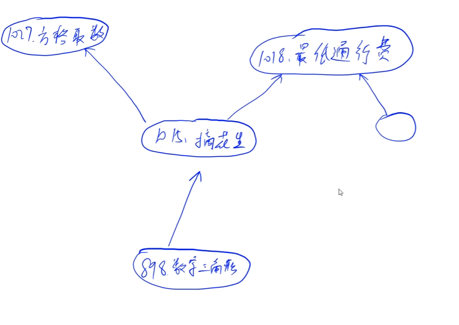
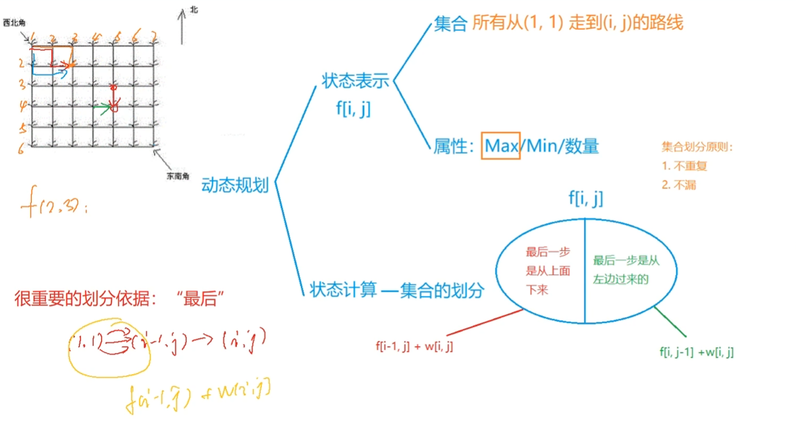
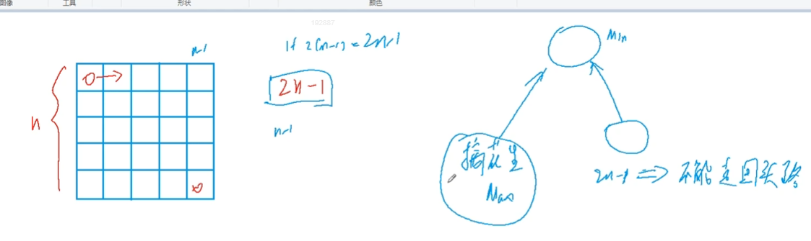
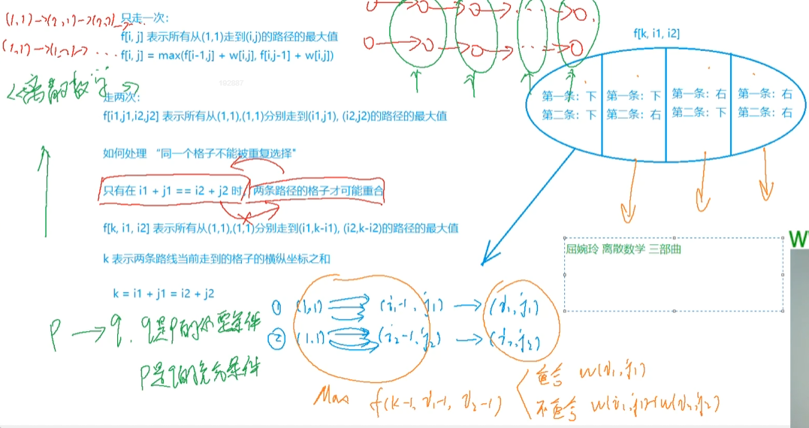
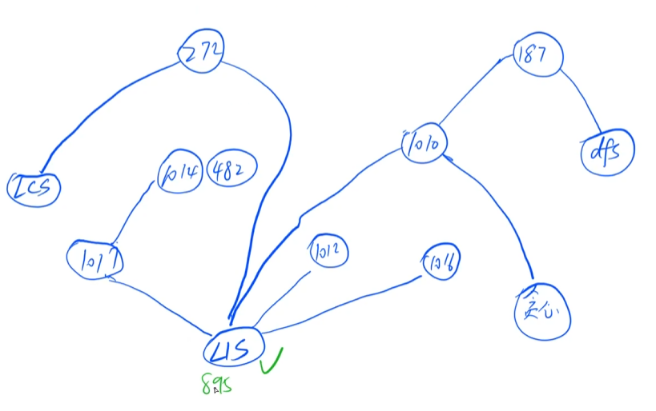
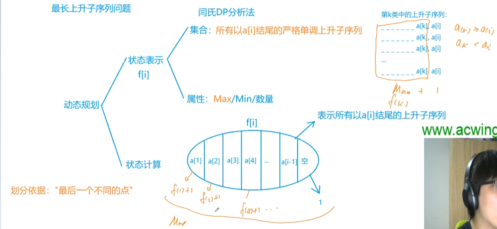
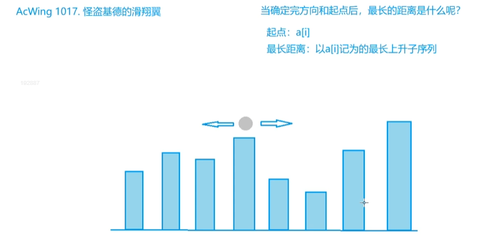
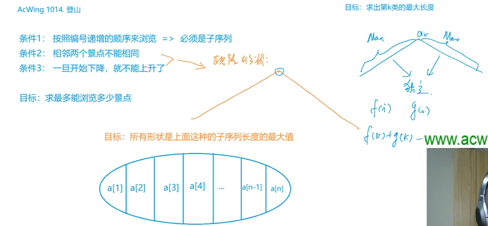
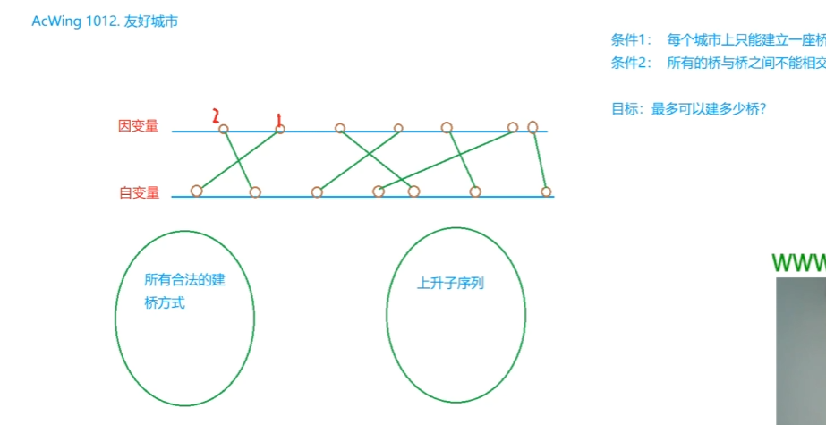
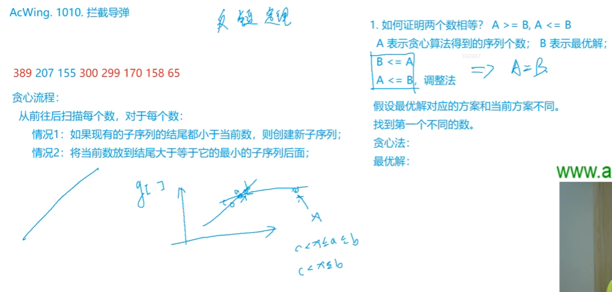

# ch1 提高-动态规划

dp 思考方式 从集合角度来考虑DP问题
- 动态规划 【详细见摘花生图】
    - 状态表示 f[i, j]  (线性f[i] 网格图f[i][j] 背包f[物品][体积] )
        - 集合
        - 属性  最大值 最小值 数量
    - 状态计算 （集合的划分） 很重要的划分依据：“最后”
        - 根据结果可能的来源进行划分  结果=f(各个子集结果)
        - 划分原则 不重（不一定满足）  不漏（一定要满足）

## 0 数字三角形模型
题谱：

### 摘花生
思考方法：

### 最低通行费
不走回头路 走2n-1步
思考方法：

与摘花生区分；最小值要处理一下特殊情况，因为从边界（0）走过来永远是最小的，所以第一行或者第一列，永远只能从左边(第一行)或上面下来(第一列)
一种思路 边界设为最大值  0* 或 *0 全部设为无穷
另一种思路： i > 1 ； j > 1分别判断处理  先算从上面来的  再算从左边来的，取最小值

### 方格取数
思考方法

## 1 最长上升子序列模型 LIS
题谱：

思考方法：

### 怪盗基德的滑翔翼
双向 LIS
思考方法：

### 登山

思考方法：

### 合唱队形

思考方法: 与登山问题一样，就是总数减去序列数

### 友好城市
思考方法：

先排序一边的城市，另一边城市找上升子序列

### 最大上升子序列和

思考方法

### 拦截导弹
LIS + 贪心
思考方式

** 一个序列最少可以被几个非上升子序列覆盖 = 最长上升子序列**

