# ch1 提高-动态规划

dp 思考方式 从集合角度来考虑DP问题
- 动态规划 【详细见摘花生图】
    - 状态表示 f[i, j]  (线性f[i] 网格图f[i][j] 背包f[物品][体积] )
        - 集合
        - 属性  最大值 最小值 数量
    - 状态计算 （集合的划分） 很重要的划分依据：“最后”
        - 根据结果可能的来源进行划分  结果=f(各个子集结果)
        - 划分原则 不重（不一定满足）  不漏（一定要满足）

## 0 数字三角形模型
题谱：


### 摘花生
思考方法：


### 最低通行费
不走回头路 走2n-1步
思考方法：

与摘花生区分；最小值要处理一下特殊情况，因为从边界（0）走过来永远是最小的，所以第一行或者第一列，永远只能从左边(第一行)或上面下来(第一列)
一种思路 边界设为最大值  0* 或 *0 全部设为无穷
另一种思路： i > 1 ； j > 1分别判断处理  先算从上面来的  再算从左边来的，取最小值

### 方格取数
思考方法


## 1 最长上升子序列模型 LIS
题谱：


思考方法：


### 怪盗基德的滑翔翼
双向 LIS
思考方法：


### 登山

思考方法：


### 合唱队形

思考方法: 与登山问题一样，就是总数减去序列数


### 友好城市
思考方法：


先排序一边的城市，另一边城市找上升子序列

### 最大上升子序列和

思考方法


### 拦截导弹
LIS + 贪心
思考方式

** 一个序列最少可以被几个非上升子序列覆盖 = 最长上升子序列**


### 导弹防御系统
<span style="color:red">**多刷**</span></br>
LIS + 贪心 + dfs[求最小步数]
思考方式
    每个数都尝试放到递增或递减序列当中

- dfs  求最小步数 
    - 记录全局最小值
    - 迭代加深

- bfs 需要的空间太大 不好剪枝

### 最长上升公共子序列
思考方法
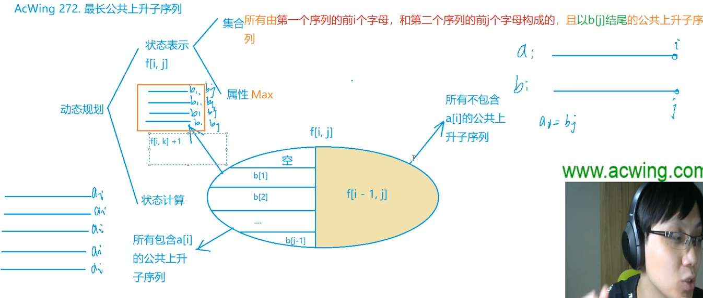


## 3 背包问题
题谱：
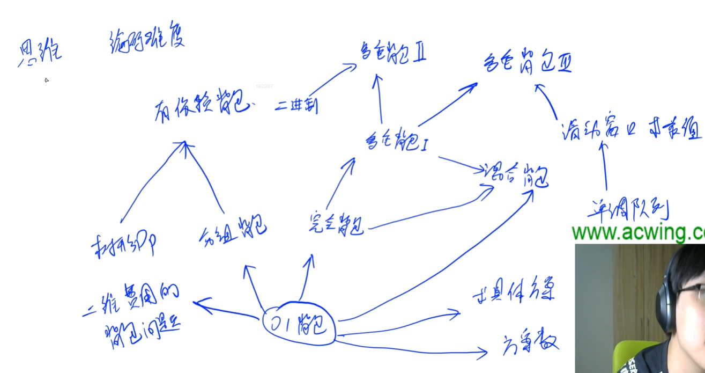


回顾背包模型：
### 01背包 【每种物品只有一个】
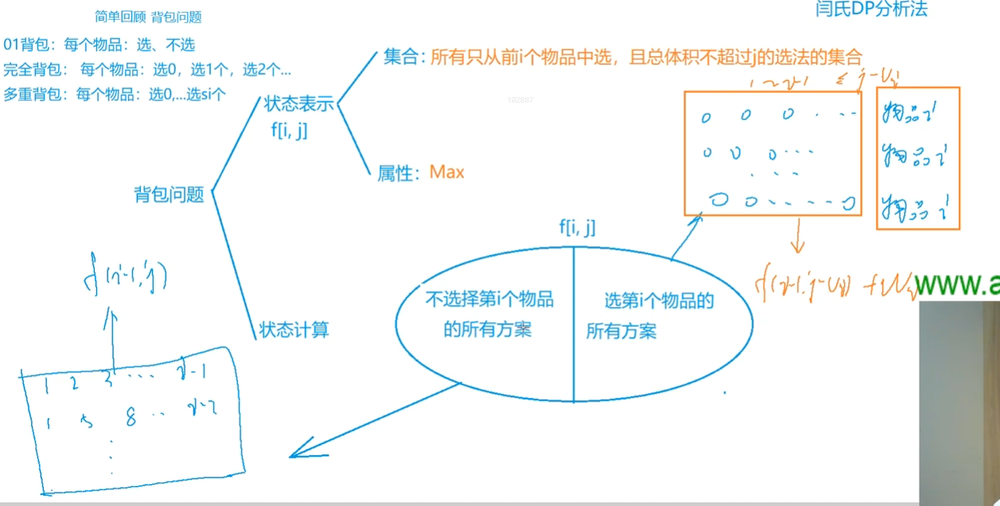

### 完全背包 【每种物品无限个】
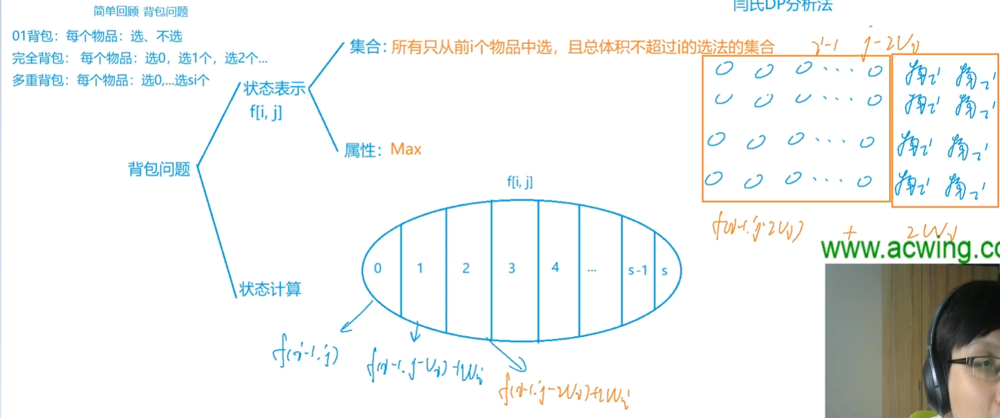
优化：【求所有前缀的最大值】

```
f[i, j] = max(f[i-1, j], f[i-1, j-v] + w, f[i-1, j-2v] + 2w,...,f[i-1, j-sv] + sw)     注意：s是不变的 = j/v 满足sv <= j 的最大的s 因为可以选无限个  所以理论上可以有无限项
f[i, j-v] = max(f[i-1, j-v], f[i-1, j-2v] + w, f[i-1, j-3v] + 2w,...,f[i-1, j-sv] + (s-1)w)

故：f[i, j] = max(f[i-1, j], f[i, j-v] + w)
```

1. 当空间优化为一维之后，只有完全背包（和多重背包的某种优化方法）的体积是从小到大循环的 【如果空间是两维的话没有限制】
2. 优化完体积之后，所有的背包问题按一下循环顺序
for 物品
    for 体积
        for 决策 (枚举每一个子集)

### 多重背包 【每种物品有限个】
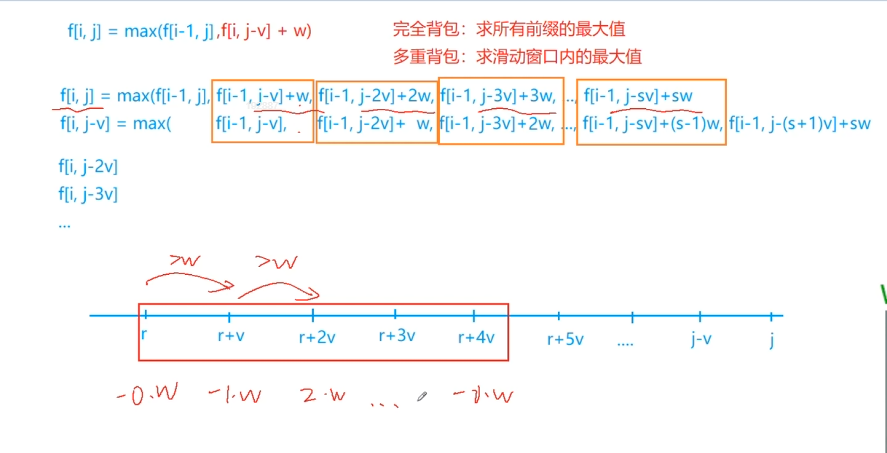
与完全背包类似，只不过物品数枚举到每种物品的上限受限制
优化：【求前面长度为s的滑动窗口的最大值】

```
f[i, j] = max(f[i-1, j], f[i-1, j-v] + w, f[i-1, j-2v] + 2w,...,f[i-1, j-sv] + sw)   注意：s是会变的，因为每个物品可选的个数不定 也就是有限项

f[i, j-v] = max(f[i-1, j-v], f[i-1, j-v-v] + w, f[i-1, j-v-2v] + 2w,...,f[i-1, j-v-sv] + sw)
          = max(f[i-1, j-v], f[i-1, j-2v] + w, f[i-1, j-3v] + 2w,...,f[i-1, j-(s+1)v] + sw)


其实就是计算往前s个窗口的最大值

故：f[i, j] = max(f[i-1, j], f[i, j-v] + w)
```
多重背包问题三： 单调队列 + 背包
<span style="color:red">**多刷**</span></br>

### 采药 

0-1 背包 优化为1维数组 体积从大到小

### 装箱问题

价值同时也是体积

### 小精灵 
二维费用
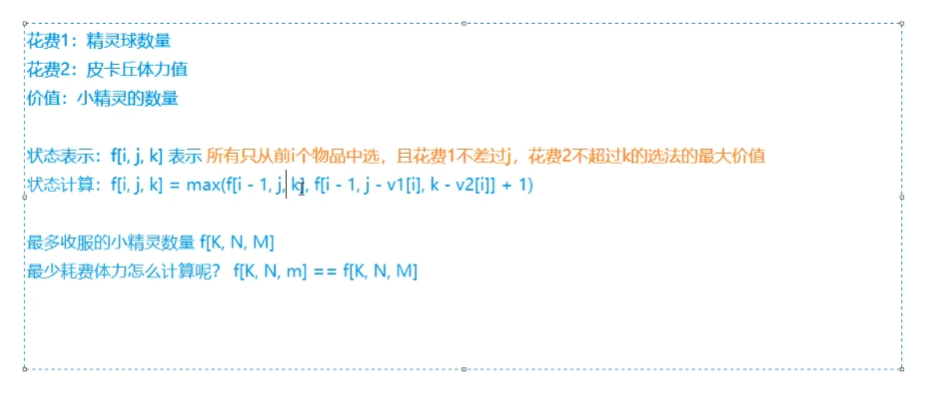

题意中皮卡丘不能四

### 二维费用
可以和 01 完全 多重 背包结合
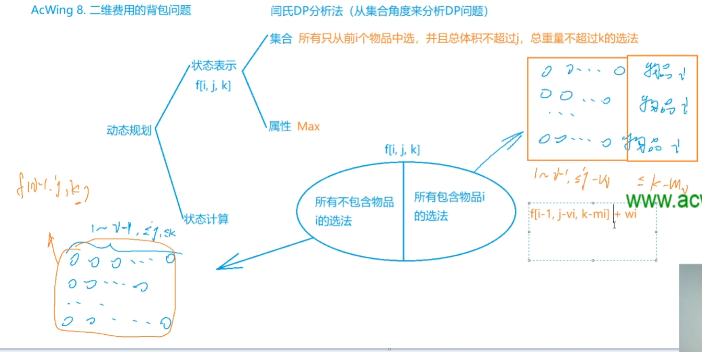


### 潜水员

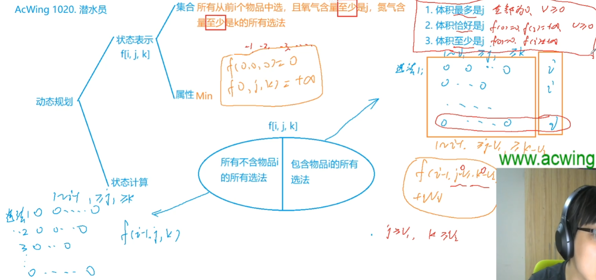
状态定义时：
体积至多是 j 全部为0 v >= 0  
体积恰好是 j => f[0] = 0 其余无穷 v>=0
体积至少是 j ==> 状态表示时 计算出为负数 也合法 因为 至少时j 实际肯定比j大
f[0] = 0 其余无穷 v 不一定大于零

初始化为无穷的目标是 =》 不使用该值


### 数字组合

求方案数


对最后一个物品分析 选该物品和不选该物品的方案数

fij 表示 前i 个物品中，恰好和为j的方案数
f ij  == > 不选 ==> fi-1j  选 ==> f[i-1][j-v[i]]
结果是 选和不选的方案数之和


### 庆功会
多重背包
- 朴素算法
- 二进制优化
将s个 打包成 logs（向上取整）组 1 2 4 8 ... 2^k, c (k是 2^k <= s 最大的值 c = s - 2^k)
打包 若干个作为一组 转化为 01背包

- 单调队列优化

### 买书
完全背包
- 优化掉一层循环
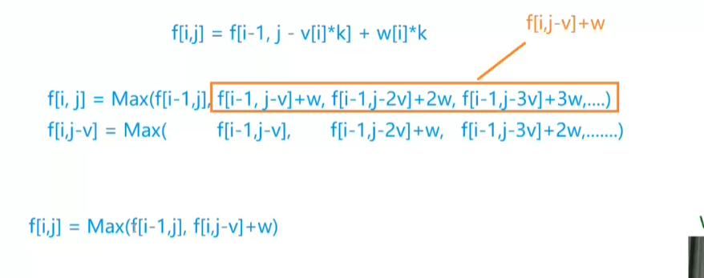
f(i, j) = max(f(i - 1, j), f(i, j - v) + w)
- 优化成一维
f[i][j] = f[i - 1][j];  // 这时候 从上一层保留下来的值就是f[i - 1][j] 优化成一维 f[j] 相等
if (j >= w[i]) f[i][j] += f[i][j -  w[i]];  // j - wi 是本层的值，所以使用到本层的小值 要从小到大遍历
==》
f[j] = f[j];  // 无意义
if (j >= w[i]) f[j] += f[j -  w[i]];
==》
if (j >= w[i]) f[j] += f[j -  w[i]];

### 背包问题求具体方案
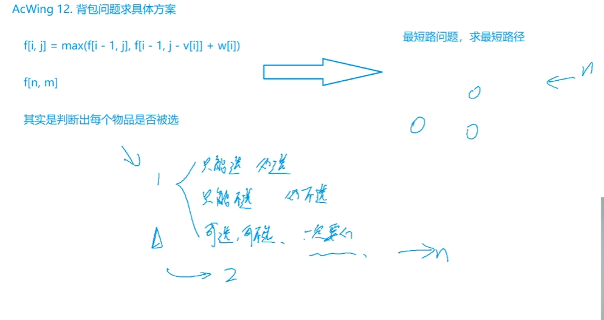
不能状态压缩 ==》 不能减维数
求当前节点是从那个节点转移来的
求解完成之后 ==》 逆向判断是从哪个状态转移来的

- 字典序最小解决【贪心】
    可选可不选时： 选，就是最小字典序

- 01 背包从前向后遍历物品
- 获取方案数要从后向前推
- 但是由于字典序最小要从前向后，所以01 背包要从后向前遍历物品

- 求解方案数 也可以新开数组在动态规划时记录

### 分组背包


### 机器分配问题

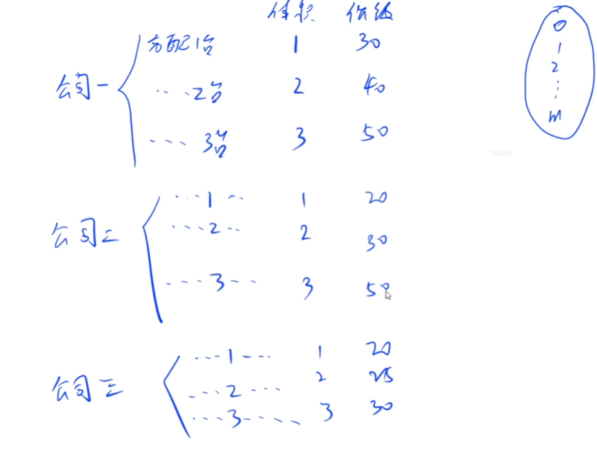


### 金明的预算方案
<span style="color:red">**多刷**</span></br>
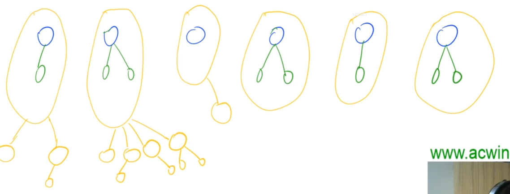

### 开心的金明

01背包 

### 货币系统
完全背包

### 货币系统 2

bn 代替 an 表示货币，范围不能缩小 也不能放大，所以 
bn 一定是从 an 中找出来的
<span style="color:red">**多刷**</span></br>
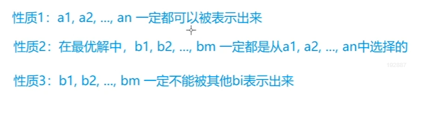
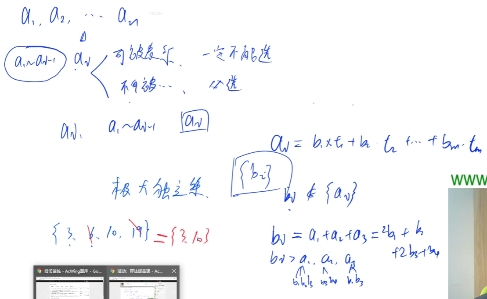


### 混合背包

第 i 件物品的类型，决定该物品使用那种状态计算
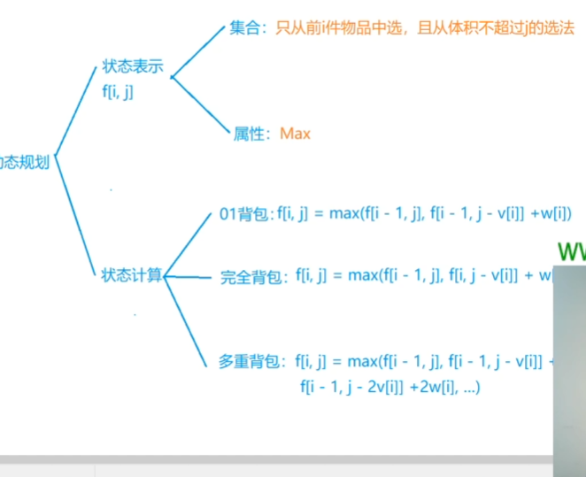


### 有依赖的背包问题
【没有上司的舞会】
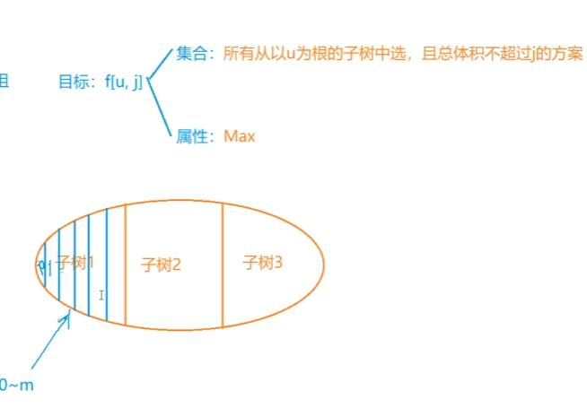
<span style="color:red">**多刷**</span></br>
按照体积划分 
选择每个子树 视为 分组背包问题

### 背包问题求方案数
达到最优解的方案数有几个
视为最短路径
以 01 为例：
f[i, j] = max(f[i - 1, j], f[i - 1, j - vi] + wi)
保存 g[i, j] 表示 f[i, j] 取得最大值的方案数 （这里f[i, j]表示从前i个物品里面选，体积不超过j的选法的集合）

三种情况：
- f[i - 1, j] 大：g[i, j] = g[i - 1, j]
- f[i - 1, j - vi] + wi 大： g[i, j] = g[i - 1, j - vi]
- 二者一样大：g[i, j] = g[i - 1, j] + g[i - 1, j - vi]

### 能量石
【耍杂技的牛 国王游戏】

贪心 + dp
所有不同的吃法的最优解：吃哪些 什么顺序吃

思路
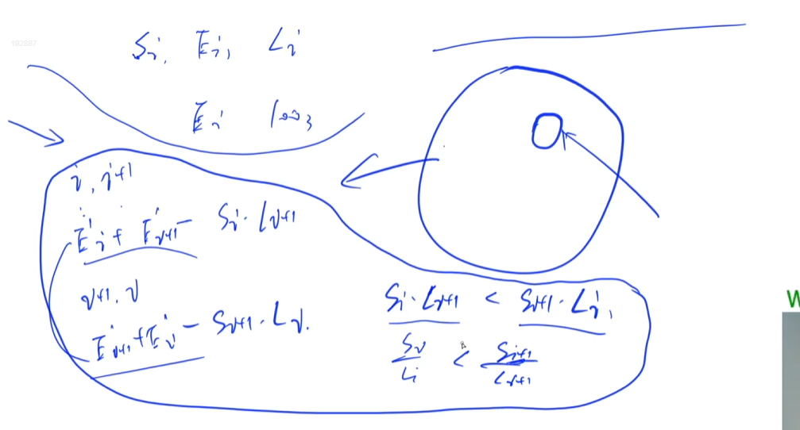
下面不太对 是恰好
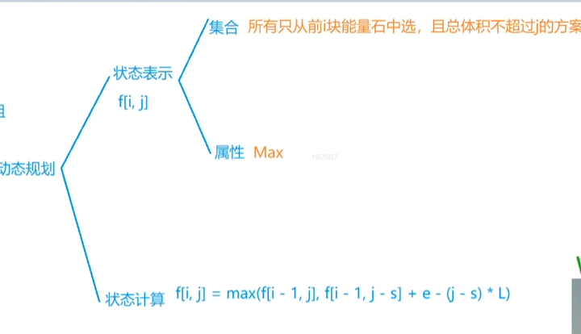


